# 10kiq: AI-Powered Financial Analysis with Citations
## Presentation Outline for AI Cohort

**Duration**: 20-25 minutes  
**Goal**: Showcase problem → solution → technical journey → learnings → community engagement

---

## 1. Hook: The Problem (2-3 min)

### The Stat
- **47% of US adults use ChatGPT for stock advice** ([Business Today, May 2023](https://www.businesstoday.in/technology/news/story/over-47-percent-of-us-adults-use-chatgpt-for-stock-advice-survey-shows-382097-2023-05-20))
- But there's a critical gap...

### The Gap: Why Generic LLMs Fail for Finance

**Demo: Ask ChatGPT**
> "What was Apple's revenue from iPhone sales last year?"

**Problems:**
1. ❌ **Hallucinations**: Makes up numbers
2. ❌ **No Sources**: Can't verify claims
3. ❌ **Outdated**: Training data cutoff
4. ❌ **No Context**: Just numbers, no insights
5. ❌ **Can't Read Tables**: SEC filings have complex tables

### The Pain Point
> "Would you trust financial advice without citations?"

**What users actually need:**
- ✅ Grounded answers from SEC filings
- ✅ Source citations with direct links
- ✅ Context (not just data)
- ✅ Ability to verify every claim

---

## 2. Live Demo: The Solution (4-5 min)

### Show https://10kiq.com

#### Query 1: Simple Revenue Question
**Ask**: "What was Apple's revenue last year?"

**Highlight:**
- ⚡ Real-time progress tracking (Planning → Fetching → Synthesis)
- 📊 Structured answer with key findings
- 📚 Source citations with direct SEC filing links
- 🎯 Confidence indicators
- ⏱️ Response time (~20-30 seconds)

**Show Debug Panel:**
- Real-time logs streaming from backend
- Vector search: "Retrieved 5 chunks, 5 above threshold 0.5"
- LLM generation: "Generating answer with llama3.1:8b"
- Completed in X seconds using 5 sources

#### Query 2: Complex Table Reading
**Ask**: "How much revenue did Apple make from iPhone sales?"

**Show:**
- Answer cites specific table from 10-K filing
- Click source link → Opens actual SEC filing
- Navigate to [Apple 10-K](https://d18rn0p25nwr6d.cloudfront.net/CIK-0000320193/c636d8a7-8025-47d2-9b13-bcf5465343b3.html)
- Show the exact table the AI read

**Compare to Perplexity Finance:**
> "Only looking at 10-K filing, how much was Apple revenue from iPhone?"

**Perplexity Problems:**
- Shows outdated data
- No context on trends
- Doesn't cite specific sections
- Can't read complex tables

#### Query 3: Multi-chats (in new chat)
**Ask**: "What was Revenue of robinhood?"

**Highlight:**
- ✅ Understands chat sessions
- ✅ Assigns a session to each chat
- ✅ Checkpointing enables conversation memory

**How did it do this?** → Leads into architecture...

---

## 3. Architecture Overview (4-5 min)

### Architecture Evolution

#### Initial Architecture (v1.0 - Simple RAG)

```mermaid
graph TB
    User[👤 User Query] --> FastAPI[FastAPI Backend]
    FastAPI --> RAG[Single RAG Agent]
    
    RAG --> Embed[Embedding Model<br/>nomic-embed-text]
    Embed --> Qdrant[(Qdrant<br/>Vector DB<br/>768-dim)]
    
    Qdrant --> Context[Build Context<br/>Top-5 chunks]
    Context --> LLM[LLM Generation<br/>llama3.1:8b]
    
    LLM --> Response[Response + Citations]
    Response --> User
    
    style RAG fill:#e1f5ff
    style Qdrant fill:#fff4e1
    style LLM fill:#ffe1f5
    style Response fill:#e1ffe1
```



**Limitations:**
- ❌ No conversation memory (stateless)
- ❌ Single agent does everything
- ❌ No multi-company support
- ❌ Simple text output only

---

#### Final Architecture (v2.0 - Multi-Agent with Checkpointing)


**Key Improvements:**
- ✅ **Checkpointing**: PostgreSQL-backed conversation memory
- ✅ **Multi-Agent**: Separation of concerns (orchestration, planning, RAG, synthesis)
- ✅ **Deterministic Planning**: 40% faster than LLM routing
- ✅ **Structured Output**: JSON for consistent UI rendering
- ✅ **Multi-Company**: Dict-based data structure for balanced retrieval
- ✅ **Session Management**: Frontend localStorage + backend checkpoints
- ✅ **Real-Time Logs**: SSE streaming for transparency

---

### Detailed Component Flow


---

### Key Components

**Frontend (React + Vite)**
- Real-time streaming UI
- Debug panel with SSE log streaming
- Multi-conversation management
- Source citation display

**Backend (FastAPI + LangGraph)**
- Async-first architecture
- PostgreSQL checkpointing for conversation memory
- Deterministic planning (not LLM routing)
- Structured JSON output

**Data Layer**
- **PostgreSQL**: Metadata + checkpoints
- **Qdrant**: 768-dim vector embeddings
- **Ollama**: Local LLM (llama3.1:8b)

**RAG Pipeline**
1. Query → Embedding (nomic-embed-text)
2. Vector Search (Qdrant, cosine similarity)
3. Retrieve Top-K chunks (default: 5 per company)
4. Build context (natural text, not JSON)
5. LLM Generation (structured JSON output)
6. Return answer + citations

### Why This Stack?

**Local LLM (Ollama) vs API:**
- ✅ Zero per-token costs
- ✅ Privacy (financial data stays local)
- ✅ No rate limits
- ✅ Full control

**RAG vs Fine-Tuning:**
- ✅ Dynamic data (SEC filings update quarterly)
- ✅ Transparency (source citations)
- ✅ No expensive training
- ✅ Easy to update knowledge base

---

## 4. Incremental Development Journey (6-7 min)

### Challenge 1: Multi-Turn Conversations & Checkpointing

**Problem**: Users couldn't ask follow-up questions. Each query was isolated.

**Initial Approach**: Tried sync `PostgresSaver`
- ❌ Error: "async context manager protocol"
- ❌ Error: "connection is closed"

**Solution**: `AsyncPostgresSaver` with singleton pattern
```python
# Manual context manager lifecycle
cls._checkpointer_cm = AsyncPostgresSaver.from_conn_string(url)
cls._checkpointer = await cls._checkpointer_cm.__aenter__()
await cls._checkpointer.setup()  # Idempotent table creation
```

**Frontend Challenge**: Session not persisting on refresh
- Race condition: Query submitted before localStorage loaded
- **Solution**: Guard async operations, disable input until session ready

**Result**: ✅ 16+ checkpoints in DB, conversation memory working

**Learning**: Always guard async operations that depend on initialization state

---

### Challenge 2: Multi-Company Comparison

**Problem**: "Compare Apple vs Microsoft revenue growth"
- Unbalanced data: 4 AAPL chunks, 1 MSFT chunk
- Missing data: "Apple's MD&A not found"

**Initial Plan**: Build parallel RAG agents (5-6 weeks)
```
Orchestrator Agent
  ├─ Parallel RAG Agent (AAPL)
  ├─ Parallel RAG Agent (MSFT)
  └─ Synthesis Agent (aggregates)
```

**Reality Check**: Tested existing system → "fairly decent results"
- ✅ Planner already generates per-company tasks
- ✅ Executor already fetches data per company
- ❌ But data structure was wrong!

**The Problem**:
```python
# WRONG: Pools all companies together
all_chunks = []
for task in tasks:
    chunks = search(ticker=task['ticker'], ...)
    all_chunks.extend(chunks)  # Loses company association!

unique = dedupe(all_chunks)[:5]  # Only 5 total!
# Result: 4 AAPL, 1 MSFT → unbalanced
```

**The Fix**: Change return type from `list` to `dict`
```python
# CORRECT: Maintain company separation
results_by_company = {}
for task in tasks:
    ticker = task['ticker']
    chunks = search(ticker=ticker, ...)
    results_by_company[ticker] = chunks[:5]  # 5 per company

# Result: {"AAPL": [5 chunks], "MSFT": [5 chunks]}
# Total: 10 chunks (equal representation) ✅
```

**Impact**:
- ✅ Fixed in 1-2 days (not 5-6 weeks)
- ✅ 95% less code than parallel agent approach
- ✅ Equal data retrieval for all companies

**Key Learning**: **Data Structure > Complex Architecture**
> "Test existing system before redesigning. Simple data structure changes often beat complex architectural additions."

---

### Challenge 3: Getting More Context in Answers

**Problem**: Answers were too brief, lacked depth

**Solutions Applied**:
1. **Increased Top-K**: 5 → 10 chunks
   - Impact: 35% improvement in answer completeness

2. **Better Query Optimization**:
   - Problem: "Chief Financial Officer" retrieved wrong section (Item 10 audit committee)
   - Solution: Added context keywords ("executive officers")
   - Impact: 60% → 95% accuracy for executive queries

3. **Prompt Engineering with Examples**:
   - Added concrete examples in planner prompt
   - Impact: 60% reduction in malformed queries

---

### Challenge 4: Structured Output (Natural Text In → JSON Out)

**The Question**: How to format context for LLM?

**Option A: JSON Context** (20-30% more tokens)
```json
{"companies": {"AAPL": {"documents": [{"text": "..."}]}}}
```

**Option B: Natural Text Context** ✅
```
Context for AAPL:
[Document 1]
Company: AAPL
Apple Inc. reported...
```

**Decision**: Natural text in, JSON out
- ✅ Saves ~2,000 tokens per query (20-30%)
- ✅ LLMs comprehend natural text better
- ✅ Easier to debug in logs
- ✅ Frontend gets structured JSON for rendering

**Key Learning**: "LLMs are trained on narrative text, not JSON. Don't over-structure your prompts."

---

### Challenge 5: UI Rendering (Deterministic vs LLM)

**Problem**: Should LLM format output (markdown/HTML) or output structured data?

**Option A: LLM Formats** ❌
- Inconsistent formatting
- Token waste (10-15% overhead)
- Hard to maintain (changing UI requires re-prompting)

**Option B: Structured Data → Deterministic Formatting** ✅
```
LLM → Structured JSON → Backend Formatter → UI Components
```

**Benefits**:
- ✅ 100% consistent rendering
- ✅ No formatting tokens wasted
- ✅ Easy A/B testing
- ✅ Can add charts/graphs without changing LLM

**Key Learning**: "LLMs should focus on semantic data extraction, not presentation. Use deterministic code for formatting."

---

### Challenge 6: Deterministic vs LLM Routing

**Decision**: Use deterministic planner instead of LLM-based routing

**Why?**
- ⚡ 40% faster (saves 2-3 seconds per query)
- 🎯 More predictable execution paths
- 💰 Fewer LLM calls = lower cost

**Trade-off**: Less flexible than pure agent routing, but speed matters for UX

**Performance Data** (from `knowledge.json`):
- Deterministic planning: ~2-3s faster
- User acceptance threshold: <30 seconds
- Only llama3.1:8b met this (30s avg, 8.7s std dev)

**Key Learning**: "Prefer deterministic logic over LLM calls when possible"

---

## 5. Model Selection & Performance Testing (3-4 min)

### The Benchmarking Process

**Tested 6 Configurations**:
1. llama3.1:8b (homogeneous)
2. qwen2.5:72b (homogeneous)
3. mixtral:8x7b (homogeneous)
4. Mixed: qwen72b (supervisor) + mixtral (planner) + llama8b (synthesizer)
5. phi3:mini (3.8B)
6. gemma3:1b

### Results: Bigger ≠ Better!

| Model | Avg Time | Accuracy | Std Dev |
|-------|----------|----------|----------|
| **llama3.1:8b** | **30s** | **72.5%** | **8.7s** |
| qwen2.5:72b | 693s | 50.8% | 247s |
| Mixed config | ~400s | 34.2% | High |

**Key Findings**:
1. **Task-fit > Raw parameters**: 8B outperformed 72B by 23x on speed with 30% better accuracy
2. **Homogeneous > Specialized mix**: Mixed config had worst accuracy (34.2%)
3. **Consistency matters**: llama3.1 has low variance (8.7s) vs qwen72b (247s)
4. **UX threshold**: <30s is acceptable, >60s = abandonment

**Why llama3.1:8b Won**:
- ✅ Speed: 30s average (meets UX threshold)
- ✅ Accuracy: 72.5% (best among all configs)
- ✅ Consistency: Low variance (predictable UX)
- ✅ Memory: Fits in 8GB RAM with buffer

**Learning**: "Benchmark with real tasks. Model size doesn't predict performance."

---

## 6. Other Technical Learnings (2-3 min)

### Consistency: Standardize LLM APIs

**Problem**: Mixed use of `ollama.Client` and `ChatOllama`
- Streaming incompatibility
- Inconsistent behavior

**Solution**: Standardized to `ChatOllama` from LangChain
- ✅ Streaming across all components
- ✅ Easier maintenance
- ✅ Consistent behavior

### Performance Optimizations

**What We Did**:
1. **Caching embeddings**: 80% compute time saved
2. **Local filing storage**: 3s fetch vs 15s download from SEC
3. **Connection pooling**: Application-level singleton
4. **Async/await**: All I/O operations
5. **Metadata filtering**: 96% search space reduction

**Results**:
- First query (new company): 55-75s (includes download + embedding)
- Subsequent queries: 3.7-5.7s
- Streaming: First token in 1-2s (90% latency reduction)

---

## 7. Transparency & Learning Features (2 min)

### Real-Time Debug Panel

**Show in Demo**:
- Server-Sent Events (SSE) streaming logs
- See exactly what's happening:
  - "Fetching AAPL 10-K from SEC EDGAR..."
  - "Embedding 1180 texts..."
  - "Retrieved 5 chunks, 5 above threshold 0.5"
  - "Generating answer with llama3.1:8b..."

**Why SSE vs WebSocket?**
- Simpler (one-way communication)
- Auto-reconnect built-in
- Perfect for logs (server → client only)

### Knowledge Sharing

**Show `knowledge.json` integration**:
- System facts displayed in UI
- Step insights (why each step matters)
- Learnings from development journey
- Performance tips

**Examples**:
- "💡 Vector search can find relevant info in <1 second across millions of words"
- "🚀 Deterministic planning is 40% faster than LLM routing"
- "🎯 Task-fit beats raw parameters: llama3.1:8b outperformed qwen2.5:72b by 23x"

---

## 8. Community Engagement & Sustainability (2 min)

### Feature Feedback Button

**Show on Site**:
- Floating "Feature Ideas?" button
- Opens Google Sheet for user requests
- Community-driven roadmap

**Current Top Requests**:
- More companies (currently 5: AAPL, MSFT, PFIZ, HOOD, AMZN)
- Time-series analysis
- Export to PDF
- Comparative charts

### Donation Button & Infrastructure

**Show vast.ai Console** (if possible):
- Rented GPU server details
- Cost: ~$X/month for GPU
- Community can help keep it running

**Infrastructure**:
- Docker Compose deployment
- PostgreSQL + Qdrant + Ollama
- Nginx reverse proxy
- All self-hosted

**Show Ko-fi Widget**:
- "Support me" floating button
- Transparent about costs

---

## 9. Future Roadmap (1-2 min)

### Near-Term 

1. **More Companies**: Expand beyond current 5
2. **Enhanced Comparisons**: 4-5 company support
3. **Time-Series Analysis**: Track metrics over quarters
4. **Faster Inference**: quicker replies

### Medium-Term 

5. **Intelligent Monitoring**: Alert when patterns change
6. **Industry Benchmarking**: Compare to sector averages
7. **Advanced Visualizations**: Charts, graphs from structured data
8. **API Access**: For developers

### Long-Term Vision

9. **Portfolio Intelligence**: Full portfolio analysis
10. **Risk Correlation**: Detect portfolio risks
11. **Custom Alerts**: "Alert when X looks like Y"

---

## 10. Infrastructure Optimization: Docker vs Native Ollama (2 min)

### The Problem: "Slow" Inference

**Symptoms**:
- 90+ seconds for 3 LLM calls
- `ollama ps` showed `PROCESSOR: 100% CPU`
- Initial assumption: Model too large or prompts inefficient

### The Root Cause: Infrastructure Bottleneck

**Docker on macOS doesn't support GPU passthrough**:
- Docker containers run in Linux VM
- Apple's Metal GPU framework not accessible
- Ollama falls back to CPU-only inference
- Result: **5-10x slower** than GPU

### The Solution

**Local Development (Mac)**:
```bash
brew install ollama
ollama serve
# Automatically uses Metal GPU
```

**Production (Linux)**:
```yaml
ollama:
  deploy:
    resources:
      reservations:
        devices:
          - driver: nvidia
            count: all
            capabilities: [gpu]
```

### Performance Impact

| Environment | GPU Access | Inference Speed |
|-------------|-----------|----------------|
| Docker on Mac | ❌ CPU-only | 90+ seconds |
| Native Mac | ✅ Metal GPU | 10-15 seconds |
| Docker on Linux | ✅ NVIDIA GPU | 8-12 seconds |

**Speedup: 6x faster** 🚀

### Key Lesson

> **"Infrastructure bottlenecks masquerade as algorithm problems."**

Always verify infrastructure before optimizing code!

---

## 11. Token Management: Beyond Preventing Crashes (3 min)

### The Problem: Context Window Overflow

**With checkpointing, conversation history grows unbounded**:
- Turn 1: 2 messages
- Turn 10: 20 messages
- Turn 15: **Context overflow** (8,192 tokens for llama3.1:8b)

### Solution Comparison

**Option 1: Sliding Window** ❌
```python
MAX_HISTORY = 8  # Keep last 8 messages
```
- Problem: Tool responses are 5,000-10,000 tokens each
- 8 messages could still be 20,000+ tokens!

**Option 2: Token-Based Trimming** ✅
```python
trimmed = trim_messages(
    state["messages"],
    max_tokens=6000,
    strategy="last"
)
```
- **Hard guarantee**: Never exceeds limit
- Adapts to variable message sizes
- LangChain built-in utility

### 10 Benefits Beyond Overflow Prevention

#### 1. **Inference Speed** (3-4x faster)
- O(n²) attention complexity
- 27,250 tokens → 6,000 tokens = **95% fewer operations**

#### 2. **Memory Efficiency** (75% less VRAM)
- Without: ~13GB VRAM (25K tokens)
- With: ~3.1GB VRAM (6K tokens)

#### 3. **Predictable Latency**
- Without: 3-25 seconds (variable)
- With: Consistent 4 seconds

#### 4. **Better Token Budget**
- More tokens for quality answers (1,500 vs 200)

#### 5. **Reduced Hallucination**
- Less context pollution from old conversations

#### 6. **Scalability**
- 2.5x more concurrent users on same hardware

#### 7. **Cost Savings**
- 76% reduction (if using paid APIs)

#### 8. **Debugging**
- Trackable metrics for system health

#### 9. **Quality of Service**
- Fair resource allocation per user

#### 10. **Model Compatibility**
- Easy switching between models

### Our System's Numbers

**Measured token usage**:
- Supervisor: 214 tokens
- Planner: 1,361 tokens
- Synthesizer: ~1,150 tokens
- **Total: ~2,725 tokens per query**

**Without trimming** (10 turns):
```
10 × 2,725 = 27,250 tokens → OVERFLOW!
Latency: 15+ seconds
```

**With trimming**:
```
Max 6,000 tokens → SAFE
Latency: Consistent 4 seconds
Can handle: 50+ turn conversations
```

### Key Takeaway

> **"Token management is not just about preventing crashes—it's a comprehensive performance, cost, and UX optimization."**

**Inference speed scales with token count**: O(n²) means halving tokens = 4x speedup!

---

## 12. Testing with Playwright: Finding Bugs Fast (2 min)

### The Bug: Empty Comparison Summary

**Problem**: Multi-company comparison summary section was rendering but empty

**Traditional Debugging** (5 min per test):
1. Start backend server
2. Start frontend server
3. Navigate to UI
4. Type query
5. Wait 30s for response
6. Manually check each section
7. Repeat for different queries

### Playwright Solution: 2-Minute Verification

**What is Playwright?**
- Browser automation framework
- Runs in real Chromium browser
- Interacts with UI like a real user
- Provides structured DOM snapshots

**How We Used It** (via MCP - Model Context Protocol):
```
"Navigate to http://localhost:3000 and test the comparison query.
Verify all sections render correctly."
```

**What It Found**:
```yaml
# Playwright snapshot:
- heading "Summary" [level=4]  # ✅ Component rendered
- paragraph [ref=e338]:         # ❌ Empty content!
```

**Root Cause Identified in 2 Minutes**:
- Backend sent `props.summary`
- Frontend expected `props.text`
- **Fix**: 1-line change

**Verification**:
- Re-ran same test
- Confirmed fix immediately
- Verified 6 sections in one run:
  - ✅ Comparison table
  - ✅ Comparison summary (now with content!)
  - ✅ Business context (both companies)
  - ✅ SEC filing links (clickable)
  - ✅ Sources panel (10 sources)

### Benefits

**Time Savings**:
- Manual: 5 min per test
- Automated: 2 min with instant verification
- Regression testing: Free (just re-run)

**Integration Testing**:
- Tests entire stack: LLM → Backend → Frontend → UI
- Catches bugs unit tests miss
- Verifies real user interactions

**Confidence**:
- Before: "I think it works..."
- After: "Playwright verified all sections ✅"

### Key Learning

> **"End-to-end testing catches integration bugs that unit tests miss. Playwright's structured snapshots are better than screenshots for verification."**

**Test Reports**: `docs/PLAYWRIGHT_TEST_REPORT_FINAL.md`

---

## 13. Suggestions to "Awe" Your Cohort (Throughout)


### Technical Deep-Dives

1. **Architecture Diagram**: Show LangGraph flow


### Metrics & Transparency

2. **Performance Stats**:
   - Model benchmarking results (llama3.1:8b = 30s, 72.5% accuracy)
   - Infrastructure optimization: 6x speedup (Docker CPU → Native GPU)
   - Token management: 3-4x faster on long conversations
   - Context trimming: 95% fewer operations (27K → 6K tokens)
   - Response time breakdown by stage

3. **Decision Log**: Show `knowledge.json` learnings


---

## 13. Structured Outputs: From 10% Errors to Zero (2 min)

### The Problem: Malformed JSON in Production

**Symptoms**:
```
ERROR: Unterminated string starting at: line 48 column 16
WARNING: Failed to parse JSON from synthesizer
Result: Raw JSON dump shown to user 😞
```

**Error rate**: 5-10% of comparison queries with `llama3.1:8b`

### Traditional Approach (Unreliable)

**Prompt Instructions**:
```
"ENSURE ALL STRINGS ARE PROPERLY CLOSED with double quotes"
"ENSURE ALL OBJECTS AND ARRAYS ARE PROPERLY CLOSED"
```

**Problem**: LLMs can't always follow formatting rules perfectly
- Complex nested structures
- Long responses with many fields
- Edge cases with quotes in content

### The Solution: Ollama Structured Outputs

**Implementation**:
```python
# 1. Define Pydantic schema
class SynthesizerOutput(BaseModel):
    answer: Answer
    companies: Dict[str, CompanyData]
    comparison: Optional[Comparison]

# 2. Pass to ChatOllama
llm = ChatOllama(
    model="llama3.1:8b",
    format=SynthesizerOutput.model_json_schema()  # ✅ Magic!
)
```

### How It Works: Constrained Generation

**Token-Level Constraints**:
- JSON schema → Grammar rules
- At each step, only valid tokens allowed
- Invalid tokens (unmatched quotes) **never generated**
- Output **mathematically guaranteed** to match schema

**Example**:
```
LLM generates: "content": "Apple's revenue
Next token options:
  ✅ " (closes string - ALLOWED)
  ❌ . (continues - BLOCKED)
  ❌ } (invalid - BLOCKED)
Result: Always valid JSON!
```

### Impact

**Reliability**:
- Malformed JSON: 10% → 0%
- No more error messages to users
- Production stability improved

**Performance**:
- Removed 400 tokens of formatting instructions (15% reduction)
- Prompt: 219 lines → 147 lines
- Faster generation (less prompt processing)

**Maintainability**:
- Type-safe with Pydantic
- Schema changes propagate automatically
- Easier debugging

### Key Learning

> **"Use API-level constraints instead of prompt instructions. Grammar-based sampling mathematically guarantees valid output."**

**Similar to**:
- Claude's Structured Outputs (announced Nov 14, 2024 | https://www.claude.com/blog/structured-outputs-on-the-claude-developer-platform) 
- OpenAI's JSON mode
- But works with **local LLMs** via Ollama!

---

## Key Takeaways (1 min)

### Technical Lessons

1. ✅ **Grounded AI**: Citations prevent hallucinations
2. ✅ **Simplicity Wins**: Data structure > Complex architecture
3. ✅ **Deterministic > LLM**: Use LLMs only when needed
4. ✅ **Test Before Redesigning**: Existing system was 90% there
5. ✅ **Benchmark with Real Tasks**: Model size ≠ performance
6. ✅ **Natural Text In → JSON Out**: Don't over-structure prompts
7. ✅ **Observability**: Log everything for debugging
8. ✅ **Async-First**: All I/O operations
9. ✅ **Infrastructure First**: Verify GPU/hardware before optimizing code
10. ✅ **Token-Based Trimming**: O(n²) complexity means tokens = performance
11. ✅ **End-to-End Testing**: Playwright catches integration bugs unit tests miss
12. ✅ **Structured Outputs**: API constraints > Prompt instructions for reliability

### Product Lessons

13. ✅ **Community-Driven**: Users guide the roadmap
14. ✅ **Transparency**: Show how it works (debug panel)
15. ✅ **Education**: Share learnings (knowledge.json)
16. ✅ **Sustainability**: Transparent about costs

---

## Appendix: Demo Queries

### Basic Queries
1. "What was Apple's revenue last year?"
2. "How much did Apple make from iPhone sales?"
3. "What about the previous year?" (tests context)

### Comparison Queries
4. "Compare Apple and Microsoft revenue growth"
5. "Which company has higher profit margins?"

### Complex Queries
6. "What are Apple's main risk factors?"
7. "Who is Apple's CFO and what is their background?"

### Edge Cases
8. "What is Tesla's revenue?" (unsupported company → graceful error)
9. "Compare 5 companies" (tests limits)

---

## Backup Slides / Topics

### If Time Permits

- **Security**: Rate limiting, API key auth (future)
- **Deployment**: Docker Compose, production considerations
- **Testing Strategy**: Playwright end-to-end testing, unit + integration tests
- **Error Handling**: Graceful degradation, retry logic
- **Caching Strategy**: Redis + PostgreSQL + Qdrant

### If Questions Arise

- **Why not fine-tuning?**: Dynamic data, transparency, cost
- **Why local LLM?**: Privacy, cost, control
- **Why Qdrant?**: Performance, filtering, scalability
- **Why dual storage?**: Resilience, optimization, analytics

---

**Total Duration**: ~20-25 minutes  
**Presentation Style**: Live demo-heavy, technical deep-dives, transparent about challenges  
**Goal**: Show real engineering journey, not just polished results

---

## Presentation Preparation Checklist

### Before Presentation

- [ ] Test all demo queries on production site
- [ ] Prepare backup recordings (in case live demo fails)
- [ ] Have architecture diagram ready
- [ ] Open relevant code files in IDE
- [ ] Have vast.ai console ready to show
- [ ] Test debug panel streaming
- [ ] Prepare Google Sheet with feature requests
- [ ] Have ChatGPT/Perplexity comparison ready
- [ ] Check SEC filing links work

### During Presentation

- [ ] Start with browser tabs ready:
  - https://10kiq.com
  - ChatGPT
  - Perplexity Finance
  - SEC filing example
  - vast.ai console
  - Google Sheet

### After Presentation

- [ ] Share presentation outline
- [ ] Share GitHub repo (if open-sourcing)
- [ ] Share knowledge.json learnings
- [ ] Collect feedback

---

**Built with ❤️ for transparency, education, and community-driven development**