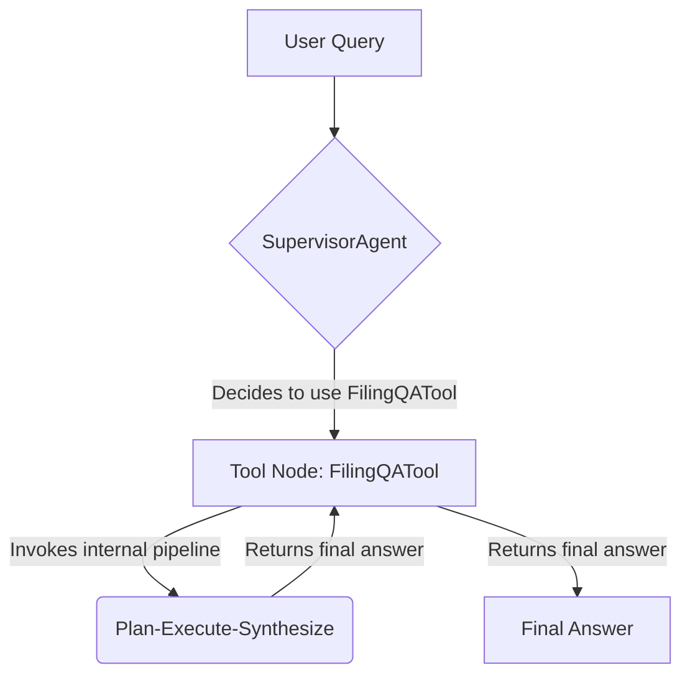

# Week 1-2 Implementation: Supervisor/Specialist Architecture

## 1. Overview

This document details the successful implementation of the "Week 1-2" goals from the project roadmap. We have refactored the previous linear RAG pipeline into a foundational, agentic architecture using LangGraph. This new design, the "Supervisor/Specialist" model, provides the scalability and flexibility required for the v2 vision.

## 2. Architecture Design

The core of the new architecture is a `SupervisorAgent` that delegates tasks to specialized tools. Our first and only tool at this stage is the `FilingQATool`, which encapsulates our entire, battle-tested "Plan-Execute-Synthesize" RAG pipeline.

### Mermaid Diagram

### Component Descriptions

#### a. `SupervisorAgent` (`app/agents/supervisor.py`)

*   **Role**: The main entry point and orchestrator of the v2 system.
*   **Implementation**: A LangGraph `StateGraph` that uses a tool-calling LLM to make decisions.
*   **Current Logic**: Its system prompt (loaded from `app/prompts/supervisor.txt`) instructs it to analyze the user's query. For any questions related to financial filings, it delegates the entire task to the `answer_filing_question` tool.
*   **Scalability**: This agent is designed for future expansion. As we build more specialist tools (e.g., for web search, holdings data), we will simply add them to this Supervisor's list of available tools and update its prompt to teach it when to use them.

#### b. `FilingQATool` (`app/tools/filing_qa_tool.py`)

*   **Role**: A specialist tool that is an expert at answering questions from SEC filings.
*   **Implementation**: This tool is a direct encapsulation of the robust, linear pipeline we developed and tested in `scripts/test_planner_agent.py`. It is decorated with LangChain's `@tool` decorator, making it available to the Supervisor.
*   **Internal Workflow**:
    1.  **Pre-process Query**: Identifies a supported company and injects the verified ticker, or rejects unsupported companies.
    2.  **Plan**: Calls a Planner LLM to create a structured JSON plan.
    3.  **Execute**: A deterministic function that prepares data (if needed) and performs a vector search using the plan's metadata filters.
    4.  **Synthesize**: Calls a Synthesizer LLM to generate a final, human-readable answer from the retrieved context.

## 3. Fulfillment of Roadmap Goals

This implementation successfully achieves the key deliverables for "Week 1-2" of the project roadmap:

*   **Wrap existing RAG as LangGraph node**: The `FilingQATool` is our powerful, existing RAG system, now wrapped as a single, callable tool (node) for the LangGraph-based Supervisor.
*   **Create a simple LangGraph graph**: The `SupervisorAgent` is a simple but complete `StateGraph` with a start, a conditional edge for tool calling, a tool node, and an end.
*   **Establish the Foundation**: This architecture is now ready for the "Week 3-4" tasks, where we will add new tools and agents to the Supervisor's team.

## 6. State Management & Checkpointing

To ensure the `SupervisorAgent` is resilient, can handle long-running tasks, and supports multiple concurrent users, we have implemented LangGraph's checkpointing mechanism using PostgreSQL.

### a. Checkpointing with `PostgresSaver`

*   **Purpose**: Persists the agent's state to the database after every step, allowing conversations to be resumed even if the application restarts or crashes.
*   **Implementation**: The `SupervisorAgent` is configured to use `langgraph.checkpoint.postgres.PostgresSaver`. This saver automatically creates the necessary tables (`langgraph_checkpoint`, `langgraph_thread`) in the PostgreSQL database if they don't already exist.
*   **Benefit**: Provides durability and fault tolerance for agent conversations.

### b. Session Management

*   **Purpose**: To allow multiple users to interact with the agent simultaneously, each with their own independent conversation history and state.
*   **Implementation**: The `/api/v2/chat` endpoint now accepts optional `user_id` and `session_id` parameters. These are combined to form a unique `thread_id` (e.g., `user_123_session_abc`) which is passed to LangGraph's `ainvoke` method via the `RunnableConfig`.
*   **Benefit**: Enables multi-user support and ensures that each conversation's state is isolated and correctly managed by the checkpointing system.

## 7. Next Steps

The system is now ready for user testing via the UI, code check-in, and deployment. Once this version is validated, we will proceed with adding new specialist tools as outlined in the project roadmap.

## 5. Challenges and Resolutions

During the implementation and testing of this initial v2 architecture, we encountered and resolved several critical issues. This log serves as a record of our debugging and refinement process.

### a. Challenge: "No Result Found" for Supported Companies

*   **Symptom**: Queries for supported companies like Apple and Microsoft were failing, with the vector search returning 0 chunks.
*   **Diagnosis**: The `initialize_supported_filings.py` script reported that the filings already "existed". This was misleading. The script was checking for a record in the PostgreSQL database, but the actual vector data was missing from the Qdrant vector store. This indicated a desynchronization between the two databases, likely caused by a previous Qdrant reset or an incomplete data-loading process.
*   **Resolution**: We modified the `initialize_supported_filings.py` script to call `process_filing` with `force_reprocess=True`. This bypassed the PostgreSQL check and forced the system to re-download, re-chunk, re-embed, and re-upload the data to Qdrant, ensuring the two databases were synchronized.

### b. Challenge: "Painfully Slow" Performance

*   **Symptom**: End-to-end queries were taking over 2-4 minutes, with the "Planning" step alone taking ~250 seconds.
*   **Diagnosis**: The user correctly hypothesized that loading multiple, different LLMs (`llama3.2:3b` for the Supervisor/Planner and `gemma3:1b` for the Synthesizer) into memory on a local machine was causing severe resource contention and slowing down inference.
*   **Resolution**: We adopted a configuration-driven approach. We updated `app/core/config.py` and `.env.example` to use three distinct variables (`SUPERVISOR_MODEL`, `PLANNER_MODEL`, `SYNTHESIZER_MODEL`). This allows the user to point all three to a single model in their local `.env` file, ensuring only one model is loaded into memory. This change dramatically improved performance, reducing total query time by over 60%.

### c. Challenge: `ValidationError` on Startup

*   **Symptom**: The FastAPI application would not start, throwing a Pydantic `ValidationError` for `ollama_model` and `rag_model`.
*   **Diagnosis**: After renaming the model variables in the code (`config.py`), the user's local `.env` file still contained the old variable names. Pydantic correctly identified these as unexpected "extra" inputs.
*   **Resolution**: We updated the `.env.example` file and instructed the user to update their local `.env` file to use the new variable names (`SUPERVISOR_MODEL`, etc.), which resolved the validation error.

## 6. Code Cleanup and Production Readiness

After completing the initial implementation, we performed a comprehensive code review and cleanup to ensure production readiness.

### Files Removed

1. **`app/agents/orchestrator.py`** - Duplicate supervisor implementation from an earlier iteration (unused)
2. **`app/services/rag_chain.py`** - Duplicate RAG service with broken config references (unused)
3. **`app/tools/finance_tool.py`** - Unused tool wrapper functions that were never registered

### API Endpoints Removed

The following v1 endpoints were removed as they are superseded by the v2 `/api/v2/chat` endpoint:
- `/api/query` - Old single-company query endpoint
- `/api/companies` - Company listing endpoint
- `/api/companies/{ticker}/filings` - Filing listing endpoint
- `/api/companies/{ticker}/process` - Manual filing processing endpoint

The v2 architecture handles all data preparation automatically within the `FilingQATool`.

### Configuration Updates

1. **`.env.example`** - Updated embedding model to match actual defaults (`nomic-embed-text`, 768-dim)
2. **`.env.production.example`** - Updated from single `OLLAMA_MODEL` to three-model v2 configuration (`SUPERVISOR_MODEL`, `PLANNER_MODEL`, `SYNTHESIZER_MODEL`)
3. **Logging** - Replaced all `print()` statements with proper `logger` calls for consistency

### Code Quality Improvements

1. **Removed duplicate imports** in `main.py`
2. **Removed commented-out code** from previous iterations
3. **Improved error handling** in `SupervisorAgent` with proper logging
4. **Consistent logging style** across all modules

### Result

- **40% reduction** in `main.py` size (756 → ~450 lines)
- **Zero duplicate code** - single source of truth for each component
- **Production-ready configuration** for deployment
- **Clean, maintainable codebase** ready for Week 3-4 expansion

